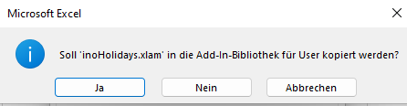
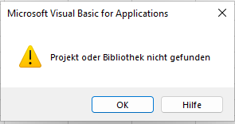
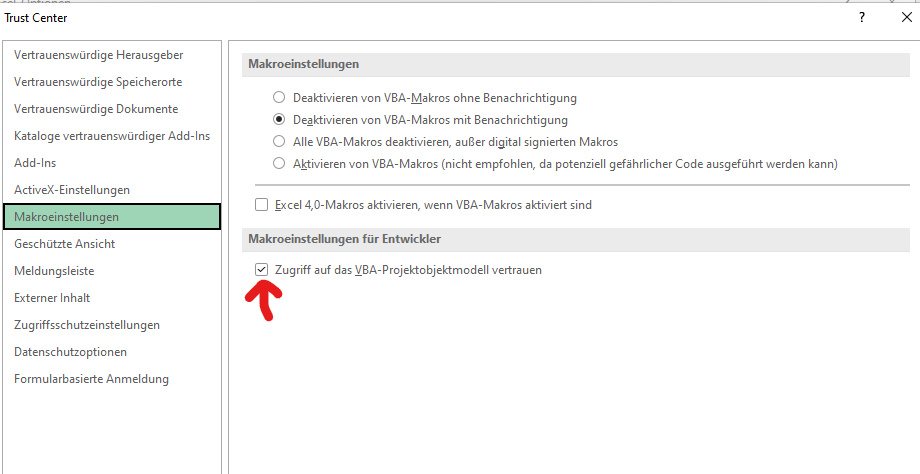

# Excel Add-In for various date calculations and conversions conversions and to list public holidays and import a public holiday list to Outlook an MS Project 

inoHolidays offers functions to calculate Easter and the 4th Advent Sunday for given year and  do conversion from a Christian date to an Islamic date and vice versa. 

Furthermore a list for public holdidays for a given county can be generated. The holiday list can be imported to MS Outlook and MS Project. For  some counties there is the choice which regional holiday shoud be imported.

Currently the user interface is available in English and German. The language is chosen by the add-in according to the language of the Excel GUI.

Currently holidays are available for these countries:

* Austria
* Belgium (States: All, Flandern, Wallonie, Französische Gemeinschaft, Deustche Gemeinschaft)
* Czech Republic
* Danmark
* France (States: All, Grand Est)
* Germany (States according to https://www.datenportal.bmbf.de/portal/de/G122.html: All, BW, BY, BE, BB, HB, HH, HE, MV, NI, NW, RP, SH, SL, SN, ST, TH = Thüringen)
* Hungary
* Luxembourg
* Netherlands
* Ireland
* Italy (States: All, Alto Adige)
* Poland
* Slovakia
* Slovenia
* Sweden
* Switzerland
* Turkey
* United Kingdom (States: All, England, Northern Ireland, Scotland, Wales)

To execute the unit tests in the modules starting with mdl_UnitTest the COM add-in rubberduck needs be installed (https://github.com/rubberduck-vba/Rubberduck).
(Thank you guys for your work)

Line numbering in the code is generated with the code from https://github.com/INOPIAE/inoLineNumbering.

## Installation

Download the file download_inoHolidays.zip to your system and unzip the content.

In Excel use File - Options

Choose tab Add-ins and select "Manage Excel-Add-Ins" and click go.

Use "Browse" to select inoHolidays.xlam and make sure inoHolidays is ticked.

If you are prompted for Copy "inoHolidays.xlam" to Add-In-Library click NO.

If you have no MS Project installed the folloing messages will occur during the installation:

Both messages can be finished with OK.

Next adjust some settings within Excel.

Open File - Options - Trust center - Trust Center Settings

Navigate to Macro settings and activate Grand accees to VBA-project object model

Now the Add-In is available.

## Usage

### Ribbon
In the tab Formulas there is a group inoHolidays which contains these buttons:

* Import Holidays - Retruns a list of all public holidays for a given year and country
* Function Easter - Return the date of Easter Sunday of a given year as fixed date or as function
* Function LastAdvent - Return the date of 4th Advent Sunday of a given year as fixed date or as function
* Add holidays to Outlook - Adds all public holidays for a given year and country to Outlook
* Add holidays to MS Project - Adds all public holidays for a given year period and country to a MS Project Calendar

### Functions

Within the function wizzard the category inoHolidays shows these functions

* Easter(GivenYear) - returns the date of the Easter Sunday of a given year
* isHoliday(GivenDate, [Country], [State]) - Checks whether the given date is a holiday for a given country and tentative state.
* LastAdvent(GivenYear) - returns the date of the 4th Advent Sunday of a given year
* DayInMonth(GivenYear, GivenMonth, DayInWeek, NumInMonth) - returns a date given by year, month, weekday and occurance in a month.

    DayOfWeek - given as number, 1 - Sunday to 7 - Saturday
    NumInMonth - given as number, 1 - 5, 6 = last of month
        
* getChristianDate(GivenIslamicDate) - returns a christian date

    spelling of isalmic month: Muharram, Safar, Rabi I, Rabi II, Jumada I, Jumada II, Radschab, Sha'ban, Ramadan, Schawwal, Dhu'l-Qa'dah, Dhu'l-Hijja, eg. 1. Muharram 1442 AH
* getIslamicDate(GivenDate) - returns an islamic date
