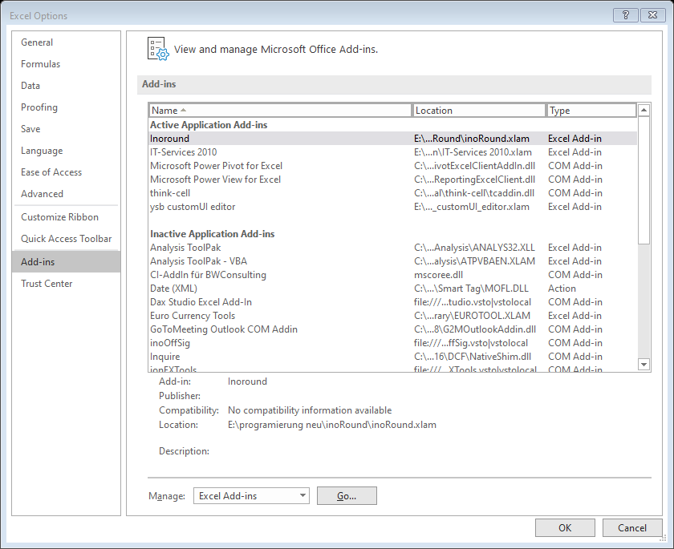
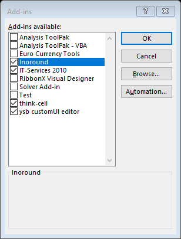

# Excel Add-In which adds functions to calculate Easter Sunday and the 4th Advent Sunday as well as functions to get information about public holidays and a list of public holidays and add the list to Outlook and MS Project
Currently the user interface is available in English and German. The language is chosen by the add-in according to the language of the Excel GUI.

Currently holidays are available for these countries:

* Austria (States: All)
* Germany (States according to https://www.datenportal.bmbf.de/portal/de/G122.html: All, BW, BY, BE, BB, HB, HH, HE, MV, NI, NW, RP, SH, SL, SN, ST, TH = Th�ringen)
* Netherlands
* Italy (States: All, Alto Adige)
* Poland
* Sweden
* Switzerland

To execute the unit tests in the module mdl_UnitTestClsHolidays.bas the the COM add-in rubberduck needs be installed (https://github.com/rubberduck-vba/Rubberduck).
(Thank you guys for your work)

## Installation

Download the file download_inoHolidays.zip to your system and unzip the content.

In Excel use File - Options

Choose tab Add-ins and select "Manage Excel-Add-Ins" and click go.

Use "Browse" to select inoHolidays.xlam and make sure inoHolidays is ticked.

Now the Add-In is available.

## Usage

### Ribbon
In the tab Formulas there is a group inoHolidays which contains these buttons:

* Import Holidays - Retruns a list of all public holidays for a given year and country
* Function Easter - Return the date of Easter Sunday of a given year as fixed date or as function
* Function LastAdvent - Return the date of 4th Advent Sunday of a given year as fixed date or as function
* Add holidays to Outlook - Adds all public holidays for a given year and country to Outlook
* Add holidays to MS Project - Adds all public holidays for a given year period and country to a MS Project Calendar

### Functions

Within the function wizzard the category inoHolidays shows these functions

* Easter(GivenYear) - returns the date of the Easter Sunday of a given year
* isHoliday(GivenDate, [Country], [State]) - Checks whether the given date is a holiday for a given country and tentative state.
* LastAdvent(GivenYear) - returns the date of the 4th Advent Sunday of a given year

